<!-- _class: lead -->

# 從新生到能解題、能做作品

## 資訊管理系的程式設計學習地圖

<!-- markdownlint-disable-next-line MD033 -->
<span class="course-badge">基礎程式設計微學分課程｜給四技與二技新生</span>

<!-- markdownlint-disable-next-line MD033 -->
<div class="author">國立臺北商業大學資訊管理系 林俊杰助理教授</div>

---

# 今天的學習地圖：從課程到建構開發能力

| 段落 | 學習主線 |
| --- | --- |
| 01–04 | 四技／二技課程地圖 → 資訊系統概念 → 程式語言 → 框架與應用 |
| 05–07 | 資料庫 → 專題 → 作業系統與檔案操作 |
| 08–10 | 版本管理 → Java、Python 實務操作 → DOMjudge 評量驗證 |
| 11–12 | AI 協同學習 → 其它補充資料 |

> 每一段都在回答同一件事：**我現在學的能力，如何讓下一步的作品真的做得出來？**

---

# 希望大家能理解的三件事

1. **看懂自己的修課路徑**：四技與二技起點不同，但都在累積可整合的能力。
2. **建立正確的學習方式**：程式不是背指令，而是拆解問題、反覆驗證。
3. **完成第一個開發循環**：親自完成寫程式、執行、找錯、提交與回顧。

> 目標不是三天變成工程師；而是帶著可持續練習的方法，進入大學的第一堂程式課。

---

<!-- _class: activity -->

# 問一下：你現在和程式有多熟？

請選最接近你的狀態；**沒有標準答案，也不是能力測驗。**

| A | B | C | D | E |
| --- | --- | --- | --- | --- |
| 幾乎沒有寫過程式 | 上課或社團碰過一點 | 曾自己寫過小作品 | 已有想做的作品點子 | 我覺得我還不錯喔 |

接著請在心中回答：**我最想解決的問題是什麼？**

> 今天結束時，你不必全部學會；但要能說出「下一步可以練什麼」。

---

# 第一段：資訊管理？

先認識資管在解決什麼問題、課程如何累積能力，以及你可以從哪些方向開始探索。

---

# 資訊管理系在做什麼？

資訊管理把 **人、流程、資料、系統與商業問題** 連起來。

| 你會面對的問題 | 資管的工作方式 | 可能產出的成果 |
| --- | --- | --- |
| 店家不知道什麼商品賣得好 | 蒐集、整理、分析資料 | 儀表板、報表、建議 |
| 社團報名一直靠試算表 | 分析流程、設計資料與介面 | 報名網站或小工具 |
| 資料外洩、帳號被盜 | 設計權限、資安與備援 | 安全的系統流程 |
| 使用者覺得系統難用 | 觀察需求、設計互動 | 改善後的 App／網站 |

---

# 資管的核心：管理、技術與應用的交會

| 面向 | 資管學生會學什麼 | 最終要回答的問題 |
| --- | --- | --- |
| 管理 | 組織流程、專案、行銷、財務與決策 | **這件事為什麼要做？先做什麼？** |
| 資訊技術 | 程式、資料庫、網路、雲端與資安 | **系統如何可靠地做出來？** |
| 應用與人 | 使用者需求、介面、資料分析與溝通 | **做出來後，誰會用、怎麼產生價值？** |

> 資管不是把商業課和程式課放在一起而已；而是學會用技術改善流程、讓資料支持判斷，並把成果交到真正的使用者手上。

---

# 同一個技術問題

## 還要思考人與流程

以「校園活動報名系統」為例：

| 只看技術 | 加上管理與應用後 |
| --- | --- |
| 能不能做出報名表單？ | 什麼資訊真的需要蒐集？誰有權限查看？ |
| 資料能不能存進資料庫？ | 名額滿了怎麼處理？候補、取消、通知的流程是什麼？ |
| 網站／App 能不能上線？ | 新生是否能在手機上快速完成？承辦人如何統計與決策？ |

**資管的好系統，不只「能用」，還要能支援人、流程與決策。**

---

<!-- _class: activity -->

# 從使用經驗開始：報名時哪一步最容易卡住？

請回想一次活動、課程或社團報名，先選一個你最在意的時刻：

| 找活動 | 填資料 | 等結果 | 改變決定 |
| --- | --- | --- | --- |
| 資訊是否看得懂？ | 欄位是否太多？ | 有沒有成功、何時通知？ | 能否取消、候補遞補？ |

接著說出一句：**「如果我是新生，我希望系統能……」**

> 先觀察使用者的困難，再決定系統要保存哪些資料、執行哪些規則。

---

# 程式設計在整個資管能力中的位置

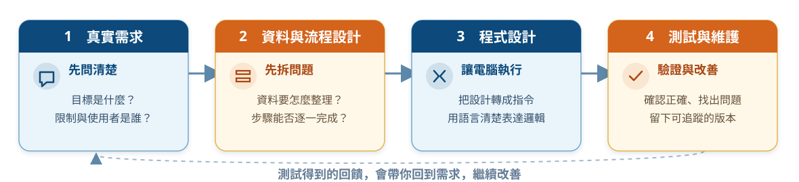

程式是把想法落地的工具；但**好作品一定也需要溝通、資料觀念與使用者視角**。

> 需求從哪裡來、資料怎麼被整理、程式在哪裡實作，以及回饋如何讓系統變得更好。**

<!--
講稿：
這張圖要修正「寫程式就是從第一行程式碼開始」的印象。真正的開發先從需求開始：要解決誰的什麼問題？有哪些時間、預算、規則或資料限制？接著才把需要處理的資料與流程拆成可執行的小步驟。程式設計是把這些步驟寫成電腦看得懂的指令，而不是憑空產生功能。

最後一段的測試與維護同樣重要。測試不只是找錯，也在驗證最初的需求是否被正確理解；維護則讓團隊能知道改過什麼、為什麼改、是否可以回復。圖下方的虛線提醒學生，結果與使用者回饋常會讓我們回頭修改需求，因此開發是一個循環，而不是一次直線作業。
-->

---

# 四種修課起點，累積的是同一套系統能力

| 學制／班別 | 入學後的程式起點 | 接著會連到的能力 |
| --- | --- | --- |
| 四技日間部 | 程式設計（一）（二），備註為以 **Java** 為主 | 資料結構、資料庫、網路、系統、資安、專題 |
| 四技技優領航專班 | **Python 程式設計（一）（二）** | 資料結構、資料庫、雲端／網路、系統、資安、專題 |
| 二技日間部 | 第一學期必修 **Python 程式設計** | 資料庫、物件導向分析設計、網路、專題、行動商務 |
| 二技進修部 | 第一學期必修 **程式語言** | 物件導向分析設計、網路、資料庫、行動商務；再以選修加深實作 |

**重點不是先學哪一個語言，而是把「理解問題、寫出步驟、驗證結果」的基本功練穩。**

> 依 115 學年度入學適用之四份科目表整理；實際開課、選修與分班請以系上公告為準。

<!--
[Sources]
- 449316577.pdf｜四年日間部資訊管理系課程科目表（115學年度入學新生適用）
- 777929217.pdf｜四技日間部資訊管理系技優領航專班課程科目表（115學年度入學新生適用）
- 107853431.pdf｜二技日間部資訊管理系課程科目表（115學年度入學新生適用）
- 778516030.pdf｜二技進修部資訊管理系課程科目表（115學年度入學新生適用）
-->

---

# 四技學習主線：用四年逐步完成系統

| 階段 | 課程例子 | 你正在建立的能力 |
| --- | --- | --- |
| 大一：程式起步 | 計算機概論、Java／Python 程式設計 | 變數、條件、迴圈、函式、除錯習慣 |
| 大二：資料與結構 | 資料結構、資料庫管理、資訊網路 | 有效整理資料、理解資料如何流動 |
| 大三：系統實作 | 物件導向設計、作業系統、電子商務、Python | 把多個元件組成可用的服務 |
| 大四：整合與專題 | 資訊安全、資管實務專題、行動商務 | 面對真實需求、團隊合作、展示成果 |

---

# 二技學習主線：兩年內快速銜接整合應用

| 階段 | 二技日間部 | 二技進修部 |
| --- | --- | --- |
| 一年級上 | Python、管理資訊系統、資料庫、物件導向分析設計 | 程式語言、管理資訊系統、資訊倫理；可選資料結構、網站程式 |
| 一年級下 | 應用統計、資訊網路、實務專題（一） | 應用統計、物件導向分析設計、資訊網路；可選行動應用、作業系統 |
| 二年級 | 專題（二）、資訊倫理、行動商務；選修延伸資安、資料與雲端 | 電子商務、資料庫、行動商務；選修延伸資安、資料與系統實作 |

**二技不是把四技四年壓縮重播。** 要先盤點既有能力，再把程式、資料、系統分析與應用課程接成作品。

<!--
[Sources]
- 107853431.pdf｜二技日間部資訊管理系課程科目表（115學年度入學新生適用）
- 778516030.pdf｜二技進修部資訊管理系課程科目表（115學年度入學新生適用）
-->

---

<!-- _class: table-medium -->

# 後續課程不是岔路，是加深方向

科目表裡的選修，讓你可以從共同基礎走向不同應用。

| 偏好的問題 | 可關注的課程例子 | 可累積的作品方向 |
| --- | --- | --- |
| 想做網站與服務 | 網頁設計、網站應用程式設計、Linux、伺服器架設 | 校園資訊站、活動報名系統 |
| 喜歡資料與 AI | 資料可視化、機器學習與深度學習、資料探勘 | 銷售分析、分類或預測小專題 |
| 想做行動與互動 | 行動應用開發、行動應用程式設計、使用者介面 | 校園生活 App 原型 |
| 關心系統與安全 | 資訊網路、作業系統、資訊安全、雲端機房管理 | 權限規畫、部署或安全檢查 |

---

# 不只一條路：共同基礎可以延伸成更多角色

先建立程式、資料與溝通的共同基礎；再從你願意持續解的問題，逐步加深。

| 想解的問題 | 可延伸的學習組合 | 可嘗試的作品／角色 |
| --- | --- | --- |
| 讓人願意使用服務 | 網頁設計、使用者介面、行動應用 | 互動設計、前端開發、產品設計 |
| 讓資料支持決策 | 資料庫、資料可視化、資料探勘、機器學習 | 商業分析、資料工程、AI 應用 |
| 讓流程變得更有效率 | 電子商務、資訊系統、專案與流程觀念 | 數位轉型、系統分析、產品營運 |
| 讓服務可靠地上線 | Linux、伺服器架設、網路、雲端與資安 | 後端開發、雲端維運、資安實務 |

> 這些方向會彼此交會：一個能上線的產品，同時需要使用者視角、商業規則、資料與技術品質。

---

<!-- _class: activity -->

# 先選一個你願意持續探索的問題

想一下，此刻最想先靠近的一個方向：

| 1 | 2 | 3 | 4 |
| --- | --- | --- | --- |
| 做出好用的網頁／App | 用資料找出規律 | 改善流程與商業服務 | 讓系統更穩定、安全 |

**選的是問題，不是把自己綁在一個職業。** 之後的課程與作品，會讓你驗證自己真正喜歡哪一種挑戰。

---

# 第二段：資訊系統概念

假設正在開發「迎新活動報名服務」，要如何把使用者需求、規則、資料與不同裝置串在一起。

---

# 資訊系統概念：一項服務由多個元件共同完成

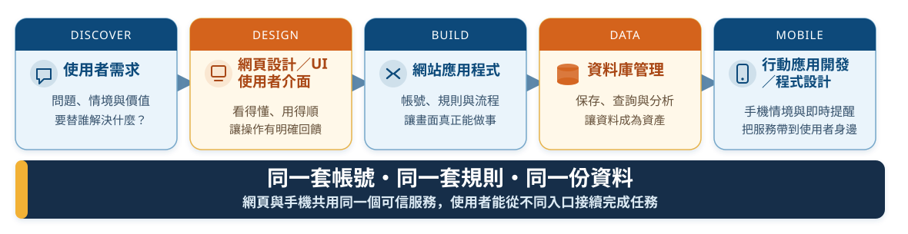

**這些課程不是各自孤立的工具，而是在學「怎麼把一個需求做成可用服務」。**

<!--
講稿：
請學生把這條流程看成同一項商業服務的不同階段，而不是五門互不相干的課。第一步是理解使用者要完成什麼任務；網頁設計與使用者介面把這個需求變成看得懂、操作順的畫面。接著網站應用程式處理帳號、資格、訂單或報名等規則；資料庫把這些資料可靠保存，讓系統可以查詢與分析；行動應用則把同一套服務帶進手機的即時、移動與通知情境。

以校園活動報名為例，網頁版可能是第一次填寫報名資料的入口，資料庫保存名額與紀錄，後端處理候補與取消規則；學生在手機上再確認報名狀態或收到提醒。重點不是做出兩套不相干的系統，而是讓網頁與行動端共用可信的帳號、規則與資料。
-->

---

<!-- _class: activity -->

# 個人小練習：把「我要報名」拆成流程

請在紙上或手機筆記寫下 **4 個步驟**，描述新生完成活動報名的過程。

範例起點：`看到活動 → 填資料 → ? → ?`

完成後，再替其中一個步驟標記它較接近哪一類工作：

| UI／UX | 後端規則 | 資料庫 | 行動提醒 |
| --- | --- | --- | --- |
| 讓人知道怎麼填 | 判斷資格與名額 | 保存報名紀錄 | 告知結果或異動 |

> 不是只有一個正確流程；重點是開始把模糊需求變成可以比較、可以實作的步驟。

---

# 資訊系統概念：資料讓服務記得發生過什麼

| 先學什麼 | 在系統中解決什麼 | 校園小例子 |
| --- | --- | --- |
| 資料結構 | 程式內如何暫存與處理資料 | 整理一份活動候補名單 |
| 資料庫管理 | 資料如何設計、保存與查詢 | 報名者、場次、繳費紀錄 |
| SQL | 如何用條件取得需要的資料 | 查出尚未繳費的名單 |
| 資料庫管理系統實作 | 如何把資料庫接到應用程式 | 報名網站的新增、查詢、修改 |

四份科目表都列有 **資料庫管理**，也都能在後續必修或選修中找到「資料庫管理系統實作」。資料庫是網站、App、資料分析與 AI 應用共同的資料地基。

<!--
[Sources]
- 449316577.pdf、777929217.pdf、107853431.pdf、778516030.pdf｜115學年度入學新生適用課程科目表
-->

---

<!-- _class: activity -->

# 進階挑戰：最後一個名額該給誰？

假設迎新活動只剩 **1 個名額**，兩位同學幾乎同時按下「送出」。請用剛才的系統觀念回答：

| 畫面與訊息 | 程式規則 | 資料庫 | 管理流程 |
| --- | --- | --- | --- |
| 送出後先顯示什麼？ | 如何判斷誰成功？ | 如何避免同一名額被登記兩次？ | 滿額後要候補、通知或開放取消嗎？ |

> 這不是只改一個按鈕：**使用者看到的結果、程式判斷、資料紀錄與現場規則必須一致。**

---

<!-- _class: four-layer -->

# 資訊系統概念：畫面之外，還需要規則、資料與維運

| 層次 | 使用者或團隊看見的成果 | 需要理解的核心概念 |
| --- | --- | --- |
| 前端（Front End） | 網頁畫面、表單、按鈕與即時互動 | HTML／CSS／JavaScript、元件、事件、呼叫 API |
| 後端（Back End） | 登入、權限、訂單／報名規則與資料處理 | 程式語言、HTTP、API、身分驗證、資料庫與測試 |
| UI／UX | 任務清楚、錯誤有提示、第一次使用也不容易迷路 | 使用者目標、資訊架構、回饋、可近用性與可用性測試 |
| 伺服器與維運 | 網站可被連線、可部署、出問題時能追蹤 | Linux、網路、網域、雲端、日誌、備份與資安 |

它們共同把**靜態畫面**推進成**可使用、可維護的資訊服務**：畫面只是入口，規則、資料與運作環境也必須可靠。

---

# 資訊系統概念：服務在手機情境中的延伸

| 行動應用要處理的面向 | 學生需要多想一步 |
| --- | --- |
| 使用者介面 | 小螢幕、單手操作、按鈕大小、字級與畫面層級 |
| 操作習慣 | 通知、相機、定位、掃碼與短時間操作；先完成最重要的一件事 |
| 專屬平台開發 | Android 常見 Kotlin；iOS 常見 Swift。可更貼近各平台功能與設計規範 |
| 跨平台開發 | 以 Flutter、React Native 等共用部分程式碼；仍要處理不同裝置與平台差異 |
| 與服務串接 | 透過 API 連接帳號、網站規則與資料庫；面對網路中斷、重試與資料同步 |

四份科目表都能找到行動相關課程：四技日間部列有「行動應用開發／程式設計」，四技技優與兩種二技皆列有「行動商務應用」；二技課表也提供或允許選修行動應用課程。它們都能把網站、資料庫與使用者需求整合到行動情境。

<!--
[Sources]
- 449316577.pdf、777929217.pdf、107853431.pdf、778516030.pdf｜115學年度入學新生適用課程科目表
-->

---

# 資訊系統概念：同一服務可有不同入口

| 做法 | 適合的情況 | 學習上會碰到的重點 |
| --- | --- | --- |
| 原生 App：Kotlin／Android、Swift／iOS | 需要深入使用相機、定位、推播、效能或平台設計規範 | 各平台 SDK、畫面生命週期、原生元件與發佈流程 |
| 跨平台 App：Flutter、React Native 等 | 希望以較多共用程式碼，較快驗證同一項服務 | 元件、狀態管理、呼叫 API；仍要測試 Android 與 iOS 的差異 |
| 行動網頁／PWA | 以連結快速提供服務、降低安裝門檻 | RWD、瀏覽器能力、網路與快取策略 |

**第一個作品不必先選最複雜的技術。** 先做出能查詢報名狀態、接收提醒或送出回報的最小流程，再依需要延伸。

---

# 資訊系統概念：同一個需求如何穿越多門課

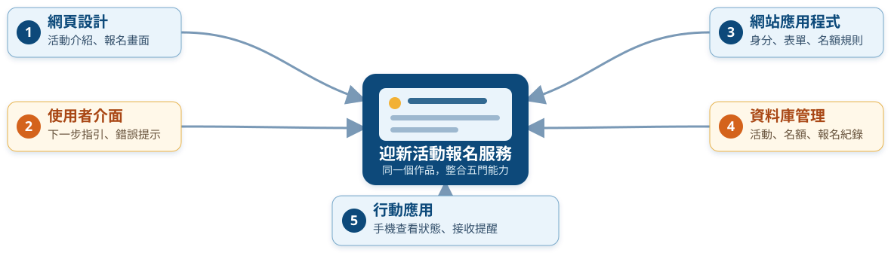

這正是資管的價值：**用技術整合流程與資料，解決真實使用者的問題。**

<!--
講稿：
不要把這五門課說成五個分開的工具。請學生從同一個使用情境開始想：新生先在網頁看到活動，填寫表單時需要清楚的下一步與錯誤提示；送出資料後，網站程式要判斷身分、名額與報名規則；資料庫保存活動、使用者與紀錄；最後，手機端讓學生追蹤狀態、接收提醒。

中央的「迎新活動報名服務」不是最後才做的專題，而是貫穿大學課程的共同作品視角。學生每學一項能力，就能回來替這個服務補上一塊：先做畫面，接著改善互動，再補規則、資料與行動體驗。
-->

---

# 第三段：程式語言

先建立共同語言，練習把問題拆成資料、步驟與可驗證的程式；語言不同，但思考與除錯的基本功可以帶著走。

---

<!-- _class: table-medium -->

# 先建立共同語言

| 名詞 | 新手版理解 |
| --- | --- |
| 演算法 | 解決問題的一連串明確步驟 |
| 程式語言 | 用來把步驟寫給電腦看的語法 |
| 資料結構 | 把資料整理得方便存取與處理的方法 |
| 資料庫 | 有規則保存大量資料的地方 |
| 框架（framework） | 已準備好常用結構與工具的「施工骨架」 |
| API | 讓兩個系統按照規則交換資料的介面 |
| 除錯（debug） | 用證據找出程式與預期不一致的原因 |

---

<!-- _class: activity -->

# 快問快答：用一句話說明名詞

請選一個名詞，用**自己的話**把它解釋給完全沒接觸過程式的人聽。

| 演算法 | API | 框架 | 除錯 |
| --- | --- | --- | --- |
| 「像食譜嗎？」 | 「像兩個系統的約定嗎？」 | 「像施工骨架嗎？」 | 「是找證據，不是亂猜嗎？」 |

如果能舉出一個校園例子，就表示你開始真的理解，而不是只記住定義。

---

# 程式語言：先學思考

## 再學表達方式

| 語言 | 適合用來理解的特色 | 常見學習情境 |
| --- | --- | --- |
| Java | 明確的型別與物件概念 | 打好結構化程式與物件導向基礎 |
| Python | 語法相對精簡、可快速實驗 | 資料處理、自動化、網站與 AI 入門 |
| JavaScript | 讓網頁能回應使用者操作 | 前端互動，也可延伸到伺服器端 |
| SQL | 用來詢問與整理資料庫中的資料 | 查詢、彙整、管理應用資料 |

**學會一種語言的基本功後，下一種語言不是從零開始，而是在轉換寫法與生態系。**

---

# 從程式語言到應用：一張技術地圖

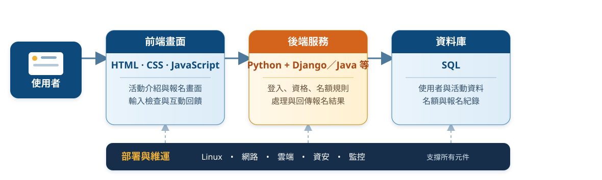

當使用者按下「送出」：**畫面收集輸入 → 後端套用規則 → 資料庫保存紀錄 → 網路與伺服器把回應送回來。**

<!--
講稿：
請學生把這張圖與前一頁的迎新活動報名服務連起來看。使用者首先感受到的是上層的畫面：網頁結構、外觀與按鈕互動；但按下「送出報名」後，請求會交給後端，按照登入、資格與名額規則處理。後端再透過 SQL 讀寫資料庫，最後由 Linux、網路、雲端與資安的能力，讓整個服務真的能穩定、安全地提供給人使用。

每層都有它要解決的問題，也彼此依賴。學生不需要一開始全會；先從程式語言的基本功開始，之後每學到一門課，就知道它在這張地圖上補的是哪一塊能力。
-->

---

# 從第一門語言，到能完成一個專案

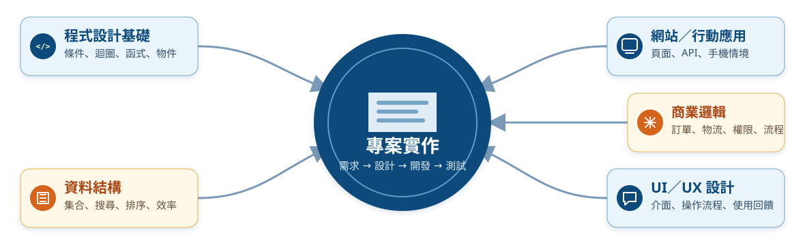

讀圖重點：每學一門課，就是替未來作品補上一項能力。

<!--
講稿：
這張圖要解決新生最常見的疑問：「我學 Java、資料結構、網頁和使用者介面，彼此到底有什麼關係？」請從中央的專案實作倒推。任何專案都需要程式基礎，讓規則能被清楚寫出；需要資料結構，讓資料能被有效整理與處理；需要網站或行動應用，把功能交到使用者手上；需要商業邏輯，把訂單、物流、權限等真實流程做正確；也需要 UI／UX，讓使用者理解、願意使用，且不容易操作錯誤。

以電商為例，Java 可以實作訂單狀態的處理；資料結構幫助整理購物車和商品清單；網站或行動應用呈現商品與訂單；商業邏輯判斷付款、庫存、物流與權限；UI／UX 則確保使用者知道目前在哪一步、出錯時如何修正。專題不是把課名湊在一起，而是把這些能力在一個真實問題中協調起來。

提醒學生：現在不需要五項都會。四技新生可以先把指定語言與基本解題練穩；二技新生則先盤點既有基礎，再把程式、資料庫與系統分析接到整合作品。之後每學一門課，就替自己的專題多補上一個可靠元件。
-->

---

# 第四段：框架、程式生態系與應用

當你不再只寫一個檔案，而要做網站、服務或 App，框架與生態系會提供可重複使用的結構；最後仍要回到使用者能否完成任務。

---

# 框架不是魔法，是幫你少造幾次輪子

以網站為例，一個框架通常協助處理：

- 路由：使用者打開哪個網址，要交給哪段程式處理。
- 資料模型：用程式描述資料表與資料間的關係。
- 表單與驗證：避免不完整或不合理的輸入。
- 身分與權限：誰可以登入、閱讀、修改資料。
- 測試與部署：讓修改後的系統仍可被檢查與上線。

例如 Django 是 Python 的 Web 框架，提供資料模型與資料存取等結構；**基礎語法與資料庫觀念仍然是使用框架之前最重要的地基。**

---

<!-- _class: table-compact -->

# 程式語言很多，核心能力相通

| 語言 | 常見的發展方向 | 常見框架／平台 | 從中可學到的觀念 |
| --- | --- | --- | --- |
| C／C++ | 系統、嵌入式、效能要求高的程式 | Qt、嵌入式 SDK、遊戲引擎 | 記憶體、資料結構、效能 |
| Java | 企業後端、資訊系統 | Spring Boot、JavaFX | 物件導向、分層設計、生態系 |
| Python | 自動化、資料、AI、網站 | Django、Flask、FastAPI、資料／AI 工具 | 清楚表達、快速驗證想法 |
| C# | .NET 網站、桌面、雲端與遊戲 | ASP.NET Core、.NET MAUI、Unity | 型別安全、工具整合、服務開發 |
| Kotlin／Swift | Android／iOS 行動應用 | Android SDK／Jetpack Compose、SwiftUI | 行動裝置情境與使用者體驗 |
| JavaScript | 網頁互動，也可在伺服器端執行 | React、Vue、Angular、Node.js | 事件、非同步、前後端串接 |
| Go／Rust | 雲端服務／安全可靠的系統程式 | Gin、Axum 等後端工具 | 並行、部署、效能與可靠性 |
| BASIC | 入門教學與早期個人電腦程式 | Visual Basic 等教學與桌面環境 | 以清楚指令建立程式概念 |

<!--
講稿：
這一頁不是要大家現在選一個「最好的」語言，更不是要你們把所有語言都學會。它想傳達的是：程式語言就像不同的表達方式；不同語言因為歷史、使用情境和社群不同，特別擅長的事情也不同。

可以從三個角度帶學生看這張表。第一，C/C++、Rust 會讓你更接近系統和效能議題；第二，Java、C#、Python、Go 常出現在資料、服務與企業系統；第三，JavaScript、Kotlin、Swift 比較直接連到網頁或手機使用者的畫面。BASIC 則提醒我們：一種語言的價值也和它所處的教育與歷史階段有關。

請學生不要把「語言數量很多」理解成壓力。先在所屬學制指定的 Java、Python 或程式語言課程中，練穩變數、條件、迴圈、函式、資料結構與除錯。之後換到另一種語言時，真正改變的常是語法、工具和慣例；拆題、設計資料、測試與閱讀文件的能力仍能帶著走。

[Sources]
- https://go.dev/doc/
- https://doc.rust-lang.org/stable/book/ch00-00-introduction.html
- https://developer.android.com/kotlin/first
- https://learn.microsoft.com/en-us/dotnet/
-->

---

# 真正要學會的，是學會寫程式

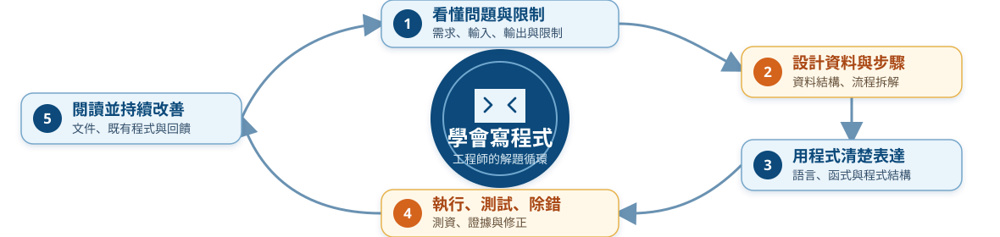

**語言是工具；可遷移的能力是拆解問題、驗證結果、閱讀文件與與人協作。**

<!--
講稿：
請把這一頁和前一頁一起講。新生最容易問「我是不是要先決定以後只學 Python、Java 或 C++？」答案是不需要。第一門語言的任務，是讓你獲得一套可重複使用的工作流程。

可以用一個簡單例子說明：不管是 Java 的成績計算器、Python 的記帳小工具，或 JavaScript 的網頁表單，第一步都不是打程式碼，而是先問輸入是什麼、輸出是什麼、哪些情況會出錯。接著把流程拆成小步驟，寫成函式，再用正常與邊界資料測試。這些工作不會因為換語言而消失。

最後提醒學生，自主學習不是背完所有語法，而是能讀官方文件、找到最小範例、自己改一個小地方並驗證結果。當這個循環建立起來，遇到新框架、新套件或新的程式語言時，就有能力自己走進去。
-->

---

# 一種語言，也是一整個生態系

| 生態系元素 | 它在幫你做什麼 | 例子 |
| --- | --- | --- |
| 標準函式庫 | 提供常見功能的可靠起點 | 文字、檔案、日期、網路 |
| 套件與套件管理 | 安裝、更新與追蹤外部功能 | `pip`、`npm`、NuGet、Maven／Gradle、Cargo、Go modules |
| 框架 | 提供常見應用的結構與慣例 | Django、Spring Boot、ASP.NET Core |
| 開源社群 | 看範例、回報問題、共同維護 | README、Issue、文件、程式碼庫 |
| 工具鏈 | 協助撰寫、測試、建置與部署 | 編輯器、測試工具、版本控制、CI |

> 使用套件不是「複製貼上就結束」；要看文件、版本、授權、安全性，並理解自己為何需要它。

<!--
講稿：
一個程式語言不只是一份語法表。當你真的開始做專案，會遇到很多已經有人解過的問題，例如寄信、讀取 Excel、登入、連接資料庫、做圖表或處理網路請求。標準函式庫與套件，讓我們不必從零重寫每一個輪子。

接著解釋「套件管理」：它像專案的材料清單。Python 常見 pip，JavaScript 常見 npm，C# 常見 NuGet，Java 專案常用 Maven 或 Gradle，Rust 有 Cargo，Go 有 modules。這些工具除了下載功能，也會記錄版本，讓隊友與日後的自己可以重建同一個專案環境。

開源並不是「網路上免費的程式碼」這麼簡單。它通常有授權條款、維護者、Issue 討論區、版本紀錄與文件。學生第一次使用開源專案時，先養成四個問題：它解決什麼問題？最近是否仍維護？授權可否用在我的情境？我是否讀懂最小範例？這些習慣也是資訊專業的一部分。

[Sources]
- https://docs.spring.io/spring-boot/reference/using/build-systems.html
- https://learn.microsoft.com/en-us/dotnet/core/introduction
- https://go.dev/doc/
- https://doc.rust-lang.org/stable/index.html
-->

---

# 語言、框架與應用：選對問題的工具

| 語言 | 代表性框架／平台 | 可用來完成什麼 |
| --- | --- | --- |
| Java | Spring Boot | 建置網站後端、REST API 與可拆分的服務 |
| Python | Django／Flask | 資料驅動網站、表單、管理後台與 API；也常與資料／AI 工具串接 |
| C# | .NET／ASP.NET Core | 網站與後端服務、桌面程式、雲端整合；也可延伸到遊戲等領域 |
| JavaScript | Node.js／前端框架 | 網頁互動、前後端資料串接 |
| Kotlin／Swift | Android／iOS 平台 | 原生行動 App 與裝置使用情境 |

**框架能加快開發，但它建立在程式、資料庫、HTTP、測試與版本控制等基本功之上。**

<!--
講稿：
這張表要避免學生形成「一個語言只能做一件事」的印象。程式語言本身提供基本能力；框架和平台則把大量常見工作整理成可重複使用的結構，因此讓團隊可以更快做出網站、API 或 App。

Java 部分可說：Spring Boot 讓 Java 專案容易建立可直接執行的後端應用，並提供 Web、資料、健康檢查等生產環境常見能力。當系統變大時，團隊可依職責把功能拆成多個服務，再透過 API 協作；但「微服務」不是任何新手專案都必須採用的答案。Java 也能用於 Android 既有程式碼與開發，但目前 Android 對新專案採 Kotlin-first；因此學 Java 的物件導向與後端基礎，未來可再銜接 Kotlin。

Python 部分可說：Django 偏向提供較完整的網站結構，包含資料模型與後台等常見能力；Flask 較輕量，適合先用小型路由與功能建立服務，再按需求擴充。Python 在資料處理與 AI 學習中很常見，原因之一是有豐富的科學運算與機器學習套件；但 AI 成果仍要回到資料品質、評估方法與使用情境。

C# 部分可說：雖然目前系上科目表沒有以 C# 為主的程式課，C# 與 .NET 仍是很值得學生知道的生態系。Microsoft 與開源社群共同維護 .NET；它可在多種平台建立 Web、服務、桌面、雲端、IoT 與遊戲相關應用。新生不需要現在立刻學，但可把它視為未來因專題、實習或職涯需求而能自主延伸的一條路。

收尾時再次提醒：框架很強，但不會替你判斷使用者需求、資料怎麼設計、測試是否完整。因此先把基礎課學好，未來學 Spring Boot、Django、Flask 或 ASP.NET Core 才會更快、更穩。

[Sources]
- https://spring.io/projects/spring-boot/
- https://developer.android.com/kotlin/first
- https://docs.djangoproject.com/en/6.1/intro/overview/
- https://flask.palletsprojects.com/en/stable/
- https://learn.microsoft.com/en-us/dotnet/
-->

---

# 框架落地：讓使用者在網頁與手機完成任務

框架提供結構，但使用者最終接觸到的是**畫面、操作流程與回饋**。

| 使用情境 | 需要完成的成果 | 常會串接的能力 |
| --- | --- | --- |
| 網頁第一次報名 | 看得懂活動、填得完表單、知道送出是否成功 | HTML／CSS／JavaScript、UI／UX、後端 API |
| 手機查看結果 | 小螢幕能快速查詢、收到提醒、保持登入狀態 | Kotlin／Swift／跨平台工具、通知、API |
| 管理者處理名額 | 查詢、候補、取消、權限與紀錄 | 後端規則、資料庫、測試與日誌 |

**同一套服務不必在每個入口重做一次規則。** 不同裝置共用帳號、規則與資料，才是可維護的產品線。

---

# 第五段：資料庫

當服務不只要顯示畫面，而要記得使用者、名額、訂單與歷程時，資料庫就是系統可靠性的核心。

---

# 資料庫：讓應用程式保存、查詢與分析資料

| 問題 | 資料庫在做什麼 | 新生可以先觀察的例子 |
| --- | --- | --- |
| 一次報名要留下紀錄 | 保存使用者、活動與報名結果 | 誰報了哪一場活動？ |
| 名額與候補會改變 | 讓程式查詢並更新正確狀態 | 還剩幾個名額？ |
| 管理者需要判斷 | 用 SQL 依條件篩選、統計與整理 | 哪些人尚未完成確認？ |

資料庫不是「放資料的箱子」而已；它要和網站規則、權限、備份與資料品質一起設計。

> 到 Java／Python 實作單元時，再回來練習如何安全地連線與讀取測試資料。

---

<!-- _class: table-medium -->

# 資料庫實作預告：連線前先辨識環境

| 情境 | 可考慮的工具 | 開始前先確認 |
| --- | --- | --- |
| 課堂練習、小型單機資料 | SQLite 與資料庫瀏覽工具 | 資料檔位置、是否可刪除重建 |
| MySQL／PostgreSQL 等 | 課程指定工具、驅動程式或 SQLTools | 主機、連接埠、帳號、資料庫名稱 |
| SQL Server／Azure SQL | MSSQL 擴充套件 | 連線字串、權限與測試資料庫 |
| 網站專案 | 語言套件與 ORM | 不把帳密直接寫進程式碼 |

> 教學環境只用測試資料與最小權限帳號；絕不把真實個資、密碼或正式帳密貼給 AI 或放進 GitHub。

---

# 第六段：專題實作

## 把各門課的能力整合成可展示的作品

專題不是最後才出現的一門課，也不是另一條岔路；而是把程式、框架、應用與資料等能力放進真實情境，透過解題與跨領域合作，做成能展示成果的練習。

---

# 由淺入深的作品地圖

| 階段 | 你可以完成的作品 | 主要練習 |
| --- | --- | --- |
| 第 1 個月 | 成績計算器、猜數字、文字小工具 | 輸入輸出、條件、迴圈 |
| 第 1 學期 | 記帳或待辦清單（終端機版） | 函式、串列／集合、檔案 |
| 第 2 學期 | 簡易資料管理程式 | 模組、例外處理、資料整理 |
| 大二以後 | 資料庫加網站／App 的小系統 | SQL、API、前後端合作 |
| 專題階段 | 解決校園或商業情境的服務 | 需求、測試、協作、展示 |

> 專題不是等到最後才開始想；每一個小作品，都是下一個作品可以重用的能力與作品集素材。

---

# 資訊領域的「作品」，通常是跨領域合作

| 角色／能力 | 在作品中的提問 |
| --- | --- |
| 程式開發 | 功能如何正確運作？ |
| 資料分析 | 資料告訴我們什麼？ |
| UI／UX 設計 | 第一次使用的人會不會卡住？ |
| 資安與維運 | 資料安全嗎？系統掛掉怎麼辦？ |
| 專案管理 | 先做什麼？誰負責？如何如期交付？ |

> 不必一開始就選定職業；先透過小作品，發現自己願意持續解的問題。

---

# 程式設計的核心循環

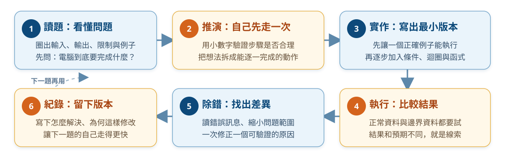

**卡住不是失敗，而是尚未取得足夠的線索。**

---

<!-- _class: activity -->

# 個人演算法練習：先寫步驟，再寫程式

題目：輸入三次小考成績，計算平均；若平均低於 60，顯示「需要加強」。

請先寫出 **不超過 6 行的中文步驟**，暫時不要寫 Java 或 Python。

檢查自己的步驟是否包含：

- 輸入：需要哪三個資料？
- 處理：平均怎麼計算？
- 判斷：什麼情況要顯示提醒？
- 輸出：使用者最後會看到什麼？

> 程式語言只是把這些清楚的步驟翻譯給電腦；步驟不清楚時，換任何語言都會卡住。

---

# 新手先練這五種能力

1. **讀懂題目**：圈出輸入、輸出、限制與例子。
2. **人工推演**：先用小數字走一遍自己的步驟。
3. **寫出最小版本**：先讓一個例子能跑，再逐步擴充。
4. **讀錯誤訊息**：把錯誤當成定位線索，不是評語。
5. **說明自己的程式**：能講清楚，才表示真的理解。

---

# 一年級的自學節奏

## 小而固定，比衝刺重要

| 每週習慣 | 建議做法 | 留下的證據 |
| --- | --- | --- |
| 課前 30 分鐘 | 預讀一個概念，寫下 1 個問題 | 筆記或提問 |
| 課後 60–90 分鐘 | 不看答案重做 1–2 題 | 可執行程式 |
| 每週一次回顧 | 整理本週最常犯的錯 | `mistakes.md` |
| 每月一個迷你作品 | 將數個概念串起來 | GitHub 專案與 README |

不求一次做大；**可完成、可回頭看、可再改善**的累積最有價值。

---

# 第七段：作業系統與檔案操作

在開啟編輯器、執行程式或交給 AI 前，先確認專案資料夾、檔案路徑與終端機指令。

---

# 寫第一行程式前，先看懂它住在哪裡

程式不是只存在編輯器裡；它是一個個檔案，住在某個資料夾（專案）中。

```text
programming-playground/       ← 你的練習空間
└── week01/                   ← 本週的小專案
    ├── hello.java            ← Java 原始程式
    ├── hello.py              ← Python 原始程式
    └── README.md             ← 說明這個練習做什麼、怎麼執行
```

之後 VS Code 會「開啟這個資料夾」、終端機會「在這個資料夾執行指令」、Git 也會「記錄這個資料夾中的版本」。

---

# 檔名與副檔名：先分清楚每個檔案的角色

| 看到的名稱 | 副檔名告訴你什麼 | 新生要知道的事 |
| --- | --- | --- |
| `hello.java` | Java 原始程式 | 交給 JDK 編譯或執行 |
| `hello.py` | Python 程式 | 交給 Python 直譯器執行 |
| `README.md` | Markdown 文件 | 專案目的、操作方式與紀錄 |
| `data.csv` | 逗號分隔資料 | 常用於表格、匯入與資料分析 |
| `image.png` | 圖片檔 | 檔案內容不是程式碼 |

**副檔名不是裝飾。** 它讓人和工具知道要用什麼方式開啟、執行或處理檔案。

> 在 Windows 檔案總管中，建議開啟「副檔名」顯示，避免把 `hello.py.txt` 誤認成 Python 程式。

---

# 路徑：檔案與資料夾的地址

```text
家目錄（Home）
└── Documents
    └── programming-playground
        └── week01
            └── hello.txt
```

| 寫法 | 意思 | 例子 |
| --- | --- | --- |
| `.` | 目前所在的資料夾 | `./hello.txt` |
| `..` | 上一層資料夾 | `../week02` |
| `~` | macOS／Linux 的家目錄 | `~/Documents` |
| `%USERPROFILE%` | Windows 使用者家目錄 | `%USERPROFILE%\Documents` |

路徑中如果有空格，請使用雙引號，例如 `cd "My Projects"`；這是新手最常遇到的指令失敗原因之一。

---

# 終端機：用文字操作同一套檔案

| 平台 | 常見入口 | 你會看到什麼 | 先記住 |
| --- | --- | --- | --- |
| Windows | Command Prompt（CMD）或 PowerShell | `C:\Users\名字>` 一類的提示字元 | 本單元的 Windows 指令以 **CMD** 為主 |
| macOS | Terminal（終端機） | `%` 或 `$` 一類的提示字元 | 使用 Unix shell 指令 |
| Linux | Terminal（終端機） | `$` 一類的提示字元 | 多數常用指令與 macOS 相近 |

提示字元不是要輸入的內容；請只輸入它後面的指令。例如看到 `$ ls` 時，真正輸入的是 `ls`。

> PowerShell 也能使用許多相近命令，但它有自己的語法與別名；剛開始請先分清楚你開的是 CMD 還是 PowerShell。

---

<!-- _class: table-medium -->

# 常用操作 I：先確認位置，再移動

| 目的 | Windows CMD | macOS Terminal | Linux Terminal |
| --- | --- | --- | --- |
| 看目前位置 | `cd` | `pwd` | `pwd` |
| 列出檔案 | `dir` | `ls` | `ls` |
| 進入子資料夾 | `cd week01` | `cd week01` | `cd week01` |
| 回到上一層 | `cd ..` | `cd ..` | `cd ..` |
| 回到家目錄 | `cd %USERPROFILE%` | `cd ~` | `cd ~` |
| 清除畫面 | `cls` | `clear` | `clear` |

**每次準備執行或修改檔案前，先看自己目前在哪裡。** Windows 可用 `cd`，macOS／Linux 可用 `pwd`。

<!--
[Sources]
- https://learn.microsoft.com/en-us/windows-server/administration/windows-commands/cmd
- https://support.apple.com/guide/terminal/get-started-pht23b129fed/mac
- https://www.gnu.org/software/coreutils/manual/html_node/pwd-invocation.html
- https://www.gnu.org/s/coreutils/manual/html_node/ls-invocation.html
-->

---

<!-- _class: table-medium -->

# 常用操作 II：建立、讀取、複製與移動

| 目的 | Windows CMD | macOS Terminal | Linux Terminal |
| --- | --- | --- | --- |
| 建資料夾 | `mkdir notes` | `mkdir notes` | `mkdir notes` |
| 寫一行文字 | `echo Hello > hello.txt` | `printf "Hello\n" > hello.txt` | `printf "Hello\n" > hello.txt` |
| 讀檔案 | `type hello.txt` | `cat hello.txt` | `cat hello.txt` |
| 複製檔案 | `copy hello.txt copy.txt` | `cp hello.txt copy.txt` | `cp hello.txt copy.txt` |
| 移動／改名 | `move copy.txt notes` | `mv copy.txt notes/` | `mv copy.txt notes/` |
| 取得說明 | `copy /?` | `man cp` 或 `cp --help` | `man cp` 或 `cp --help` |

`>` 代表「把輸出寫進檔案」：它會覆蓋同名檔案。第一次練習請只在自己的 `programming-playground` 資料夾中操作。

<!--
[Sources]
- https://learn.microsoft.com/en-us/windows-server/administration/windows-commands/copy
- https://support.apple.com/guide/terminal/manage-files-apddfb31307-3e90-432f-8aa7-7cbc05db27f7/mac
- https://www.gnu.org/software/coreutils/manual/html_node/Basic-operations.html
- https://www.gnu.org/s/coreutils/manual/html_node/mkdir-invocation.html
-->

---

# 指令輸入的四個安全習慣

1. **先看提示字元前的路徑**：我現在真的在自己的練習資料夾嗎？
2. **檔名有空格就加雙引號**：例如 `cd "My Projects"`。
3. **先列出、再操作**：先用 `dir` 或 `ls` 確認名稱，再進行 copy、move 或執行程式。
4. **不懂就查說明**：Windows 用 `指令 /?`；macOS／Linux 先用 `man 指令`。

初學時先不要練 `del`、`rmdir`、`rm` 等刪除指令；如果打錯位置，先停下來確認資料夾與檔名。

---

<!-- _class: activity -->

# 動手做：建立安全的程式練習場

依自己的平台輸入下列指令；完成後應該能看到 `Hello`。

| Windows CMD | macOS／Linux Terminal |
| --- | --- |
| `cd %USERPROFILE%\Documents`<br>`mkdir programming-playground`<br>`cd programming-playground`<br>`mkdir week01`<br>`cd week01`<br>`echo Hello > hello.txt`<br>`type hello.txt` | `cd ~/Documents`<br>`mkdir -p programming-playground/week01`<br>`cd programming-playground/week01`<br>`printf "Hello\n" > hello.txt`<br>`cat hello.txt` |

如果電腦找不到 `Documents`，先回到家目錄（Windows：`cd %USERPROFILE%`；macOS／Linux：`cd ~`），再自行建立練習資料夾。

---

<!-- _class: activity -->

# 動手做：複製、移動，再用 VS Code 打開資料夾

在剛才的 `week01` 資料夾中，完成以下動作：

| Windows CMD | macOS／Linux Terminal |
| --- | --- |
| `copy hello.txt hello-copy.txt`<br>`mkdir archive`<br>`move hello-copy.txt archive`<br>`type archive\hello-copy.txt` | `cp hello.txt hello-copy.txt`<br>`mkdir archive`<br>`mv hello-copy.txt archive/`<br>`cat archive/hello-copy.txt` |

若 VS Code 已完成指令列設定，可再輸入 `code .`，讓 VS Code 開啟「目前這個資料夾」。

**請說出差別：copy 會保留原檔；move 會把檔案換位置或改名稱。**

---

<!-- _class: activity -->

# 個人檢核：你能掌握自己的工作位置嗎？

請先在心中作答，再實際輸入一個指令確認。

| 問題 | 你應該能回答 |
| --- | --- |
| 我目前在哪個資料夾？ | Windows 用 `cd`；macOS／Linux 用 `pwd` |
| 這個資料夾有哪些檔案？ | Windows 用 `dir`；macOS／Linux 用 `ls` |
| `cd ..` 會去哪裡？ | 回到目前資料夾的上一層 |
| copy 和 move 差在哪裡？ | copy 留下原檔；move 改變位置或名稱 |

> 會操作檔案與路徑，才能知道 VS Code、Git、Java、Python 和 AI agent 到底在操作哪一個專案。

---

# 第八段：版本管理

做出作品後，下一個能力是讓修改過程可追蹤、可合作、可回復；這正是 Git 與 GitHub 要解決的問題。

---

# 版本管理：每一次修改都要能回頭看

Git 負責管理本機資料夾的版本；GitHub 是把專案放上網路、分享與協作的平台。

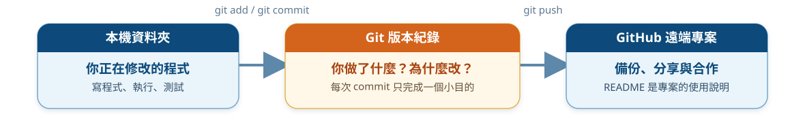

- 一次 commit 只完成一個小目的，例如「完成輸入輸出練習」。
- 專案要有 `README`：目的、如何執行、目前完成什麼。

---

<!-- _class: activity -->

# Windows 起點：在同一個專案資料夾操作

假設電腦已安裝 Git，並建立好空資料夾 `my-first-program`。

```text
C:\Users\你的帳號\Documents\my-first-program\
```

在 VS Code 開啟這個資料夾，再開啟整合終端機。PowerShell、CMD 或 Git Bash 擇一即可；以下 `git ...` 指令相同。

```powershell
git --version
git status
```

第一次執行 `git status` 顯示「不是 Git repository」是正常的：**下一步才要初始化。**

---

# 第一次使用 Git：先設定作者識別資料

```powershell
git config --global user.name "Your Name"
git config --global user.email "student@example.com"
git config --global init.defaultBranch main
git config --global --list
```

| 設定 | 用途 |
| --- | --- |
| `user.name` | 寫進每一筆 commit 的作者名稱 |
| `user.email` | 寫進 commit 的作者信箱；可使用 GitHub 已驗證信箱或隱私信箱 |
| `init.defaultBranch main` | 之後新專案預設使用 `main` 作為主幹分支 |

> 這些是**版本作者資料**，不是 GitHub 登入密碼；請把範例文字換成自己的資料。

<!--
[Sources]
- https://git-scm.com/docs/git-config
- https://code.visualstudio.com/docs/sourcecontrol/overview
-->

---

<!-- _class: git-compact -->

# `git init`：讓空資料夾開始記錄版本

確認終端機目前位於 `my-first-program`，再執行：

```powershell
git init -b main
git status
git branch --show-current
```

- `git init -b main`：建立隱藏的 `.git` 版本資料，並指定主幹為 `main`。
- `git status`：確認目前分支，以及哪些檔案尚未追蹤或已修改。
- `.git` 是版本歷史的核心；**不要把它當成一般資料夾刪除或搬動。**

> `git init` 不會把檔案上傳，也不會自動建立 commit；它只讓目前資料夾成為本機 repository。

> **選讀：** 若既有 repository 的主幹仍叫 `master`，可用 `git branch -M main` 改名；本頁新建立的專案不需要執行。

<!--
[Sources]
- https://git-scm.com/docs/git-init
- https://git-scm.com/docs/git-branch
- https://docs.github.com/en/migrations/importing-source-code/using-the-command-line-to-import-source-code/adding-locally-hosted-code-to-github
-->

---

# 建立檔案：先準備專案說明與忽略規則

先在 VS Code 建立三個檔案：

```text
my-first-program/
├── README.md        ← 作品名稱、用途與執行方式
├── .gitignore       ← 排除環境、建置與暫存檔
└── hello.py         ← 或依課程建立 hello.java
```

`README.md` 告訴別人「這個專案怎麼使用」；`.gitignore` 告訴 Git「哪些未追蹤檔案不要加入版本」。

在 VS Code 新增檔案時，名稱要完整輸入 `.gitignore`；不要存成 `.gitignore.txt`。

> `.gitignore` 也應該 commit，讓 clone 專案的同學共用相同規則。

<!--
[Sources]
- https://git-scm.com/docs/gitignore
- https://docs.github.com/en/get-started/git-basics/ignoring-files
-->

---

# `.gitignore`：排除不適合進入版本的檔案

在專案根目錄的 `.gitignore` 加入：

```gitignore
# Windows 與編輯器
Thumbs.db
.vscode/

# Python 環境與暫存
__pycache__/
*.pyc
.venv/

# Java 編譯與建置產物
*.class
out/
target/

# 本機環境變數
.env
```

`.vscode/` 有時包含團隊要共用的設定；若老師要求統一格式或除錯設定，就不要整個忽略。

> `.gitignore` 不是保密工具。密碼、API key 與個資一開始就不應放進專案或 commit。

<!--
[Sources]
- https://git-scm.com/docs/gitignore
- https://docs.github.com/en/get-started/git-basics/ignoring-files
- https://github.com/github/gitignore
-->

---

<!-- _class: table-medium -->

# 先讀懂 `.gitignore` 的四種基本寫法

| 寫法 | 意義 | 範例 |
| --- | --- | --- |
| `#` | 註解，不是忽略規則 | `# Python cache` |
| `資料夾/` | 忽略該資料夾下的內容 | `.venv/` |
| `*` | 比對任意字串 | `*.class` |
| `!` | 將原本忽略的項目排除在規則外 | `!keep.txt` |

> 規則由上往下套用；可以用 `!` 讓特定檔案重新被納入追蹤範圍。

<!--
[Sources]
- https://git-scm.com/docs/gitignore
- https://docs.github.com/en/get-started/git-basics/ignoring-files
-->

---

<!-- _class: git-compact -->

# 確認 `.gitignore` 生效，再加入必要檔案

```powershell
git status
git status --ignored
git check-ignore -v .venv
git add .gitignore README.md hello.py
git status
```

`git add` 是把指定變更放進 **staging area（暫存區）**，決定下一筆 commit 要包含什麼；它還不是 commit，也沒有上傳。

> `git add .` 會加入目前資料夾下所有變更；新手應先看 `git status`，確認沒有密碼、金鑰或不該公開的檔案。

<!--
[Sources]
- https://git-scm.com/docs/gitignore
- https://docs.github.com/en/get-started/git-basics/ignoring-files
- https://git-scm.com/docs/git-add
- https://code.visualstudio.com/docs/sourcecontrol/staging-commits
- https://docs.github.com/en/migrations/importing-source-code/using-the-command-line-to-import-source-code/adding-locally-hosted-code-to-github
-->

---

# 已經被 Git 追蹤，新增 `.gitignore` 也不會消失

`.gitignore` 只影響尚未追蹤的檔案。若 `out/app.class` 已經 commit，先讓 Git 停止追蹤，再保留本機檔案：

```powershell
git rm --cached out/app.class
git status
git commit -m "chore: stop tracking generated file"
```

接著確認 `.gitignore` 已包含適用規則，例如：

```gitignore
*.class
out/
```

> 若密碼或 API key 已經 commit 或 push，刪除檔案或加入 `.gitignore` 都無法清除歷史。請立刻停用並更換該密鑰，再請老師或維護者協助處理歷史紀錄。

<!--
[Sources]
- https://git-scm.com/docs/gitignore
- https://docs.github.com/en/get-started/git-basics/ignoring-files
-->

---

# `commit`：替一個完成的小目的留下版本

```powershell
git commit -m "docs: add project introduction"
git status
```

好的 commit message 要讓人不打開檔案，也能知道這次完成什麼：

| 類型 | 範例 | 代表的目的 |
| --- | --- | --- |
| 功能 | `feat: add score calculator` | 加入一項可使用的功能 |
| 修正 | `fix: handle empty input` | 修正一個明確問題 |
| 文件 | `docs: explain how to run` | 補充 README 或使用說明 |

**一次 commit 處理一個小目的。** 避免 `update`、`final`、`修改一下` 等看不出內容的訊息。

<!--
[Sources]
- https://git-scm.com/docs/git-commit
- https://code.visualstudio.com/docs/sourcecontrol/staging-commits
-->

---

# `log`：讀懂自己走過的版本歷史

```powershell
git log --oneline --graph --decorate --all
git show HEAD
git status
```

| 指令 | 你要觀察什麼 |
| --- | --- |
| `git log --oneline` | 每筆 commit 的短編號與訊息 |
| `--graph --decorate --all` | 分支如何分開、合併，以及目前指向哪裡 |
| `git show HEAD` | 最新 commit 實際改了哪些內容 |
| `git status` | 工作區是否還有未提交的變更 |

> commit 是本機版本紀錄；只有 `push` 之後，GitHub 才會收到這些 commits。

<!--
[Sources]
- https://git-scm.com/docs/git-log
- https://git-scm.com/docs/git-show
-->

---

<!-- _class: git-compact -->

# 第一次 `push`：把本機 repository 連到 GitHub

先在 GitHub 建立**空 repository**；已有本機 commit 時，不要勾選建立 README、License 或 `.gitignore`。

```powershell
git remote add origin https://github.com/YOUR-NAME/my-first-program.git
git remote -v
git push -u origin main
```

- `origin`：遠端 repository 的常用名稱。
- `-u origin main`：推送 `main`，並記住本機與遠端分支的對應；之後可直接 `git push`。
- HTTPS 驗證不要輸入 GitHub 帳號密碼；Windows 常由瀏覽器或 Git Credential Manager 完成，也可依課程設定使用 token／SSH。

> GitHub 是分享與協作平台；Git 的 commit 歷史仍先存在你的本機 repository。

<!--
[Sources]
- https://docs.github.com/en/migrations/importing-source-code/using-the-command-line-to-import-source-code/adding-locally-hosted-code-to-github
- https://docs.github.com/en/get-started/git-basics/about-remote-repositories
-->

---

# 主幹與開發分支：先分開工作，再決定何時整合

| 分支 | 用途 | 新生先記住 |
| --- | --- | --- |
| `main` | 可執行、已確認的主幹版本 | 不要把未完成實驗直接堆進主幹 |
| `feature/readme` | 一項功能或文件工作的短期分支 | 完成、測試、合併後即可刪除 |
| `fix/input-error` | 修正一個明確問題 | 名稱要看得出目的 |
| `develop` | 部分團隊使用的整合分支 | **只有團隊流程要求時才建立** |

```powershell
git switch -c feature/readme
git branch
git switch main
```

分支是指向 commit 的輕量指標；切換分支會讓工作資料夾呈現該分支的版本。

<!--
[Sources]
- https://git-scm.com/docs/git-branch
- https://git-scm.com/docs/git-switch
- https://code.visualstudio.com/docs/sourcecontrol/branches-worktrees
-->

---

<!-- _class: git-compact -->

# 在功能分支完成一個小修改

```powershell
git switch -c feature/readme
# 在 VS Code 修改 README.md，儲存後繼續
git status
git diff
git add README.md
git commit -m "docs: add learning goals"
git push -u origin feature/readme
```

1. `status`：知道哪些檔案改過。
2. `diff`：提交前逐行確認變更。
3. `add` 與 `commit`：留下可回頭看的本機版本。
4. `push`：讓 GitHub 收到功能分支，可建立 Pull Request 供同學檢查。

> 分支不是另一份手動複製的資料夾；不要建立 `project-final`、`project-final2` 來代替版本管理。

---

<!-- _class: git-compact -->

# 遠端有更新：先看清楚，再決定如何整合

常見情境：同學已推送新 commit、你在另一台電腦更新過，或 GitHub 上的 Pull Request 已合併。

```powershell
git status
git fetch origin
git log --oneline --graph --decorate --all
git pull --ff-only
```

| 指令 | 作用 |
| --- | --- |
| `fetch` | 下載遠端的新 commits，但暫時不改目前工作檔案 |
| `pull` | 先 fetch，再把遠端更新整合進目前分支 |
| `--ff-only` | 只接受可直接前進的情況；歷史分岔時先停下來檢查 |

若 `git status` 顯示尚未提交的修改，先確認、commit 或依教師指示暫存；不要直接反覆 pull 碰運氣。

<!--
[Sources]
- https://git-scm.com/docs/git-fetch
- https://git-scm.com/docs/git-pull
- https://code.visualstudio.com/docs/sourcecontrol/repos-remotes
-->

---

<!-- _class: git-compact -->

# `merge`：把完成的分支整合回主幹

確認功能分支已 commit 且測試通過，再回到主幹：

```powershell
git switch main
git pull --ff-only
git merge feature/readme
git push origin main
git branch -d feature/readme
```

- `git merge feature/readme` 的意思是：把該分支可到達的新 commits 整合進**目前所在的 `main`**。
- 團隊協作時，通常先在 GitHub 建立 Pull Request，經檢查後合併；本機再切回 `main` 並 pull。
- 刪除已合併的短期分支，可以讓分支清單保持清楚；刪除前先確認成果已整合。

<!--
[Sources]
- https://git-scm.com/docs/git-merge
- https://code.visualstudio.com/docs/sourcecontrol/branches-worktrees
-->

---

# Merge conflict：Git 需要你判斷哪個內容才正確

當兩個分支修改同一段內容，Git 可能無法自動合併：

```powershell
git status
# 在 VS Code 開啟衝突檔案，選擇或重新編寫正確結果
git add README.md
git commit
```

處理原則：

1. 先讀懂 current 與 incoming changes，不要盲目選「全部接受」。
2. 刪除衝突標記，執行程式或測試，確認合併後結果。
3. `git add` 標記已解決，再用 commit 完成 merge。
4. 尚未準備好時可用 `git merge --abort` 回到合併前。

<!--
[Sources]
- https://git-scm.com/docs/git-merge
- https://code.visualstudio.com/docs/sourcecontrol/merge-conflicts
-->

---

<!-- _class: git-compact -->

# `clone`：從 GitHub 取得一個已存在的專案

在 GitHub 專案頁按 **Code**，複製 HTTPS URL；終端機先移到「準備放專案的上一層資料夾」。

```powershell
cd $HOME\Documents
git clone https://github.com/OWNER/REPOSITORY.git
cd REPOSITORY
git remote -v
git log --oneline
git status
```

| `git init` | `git clone` |
| --- | --- |
| 把目前資料夾變成本機 repository | 建立新資料夾，下載完整 repository 與版本歷史 |
| 適合從自己的空資料夾開始 | 適合取得 GitHub 上已存在的專案 |

> 不要先建立同名資料夾再把檔案逐一下載；clone 才能保留分支、commit 與遠端設定。

<!--
[Sources]
- https://docs.github.com/en/repositories/creating-and-managing-repositories/cloning-a-repository
- https://git-scm.com/docs/git-clone
-->

---

<!-- _class: activity git-compact -->

# 課堂任務：把專案資料夾簽入 GitHub

以 `my-first-program` 完成並繳交：

| 必做項目 | 驗收證據 |
| --- | --- |
| 設定作者資料，以 `main` 初始化 repository | `git config --global --list`、`git branch --show-current` |
| 建立 README、`.gitignore` 與一個可執行程式 | GitHub 看得到必要檔案，但看不到環境、暫存或編譯產物 |
| 至少完成兩筆目的清楚的 commits | `git log --oneline` 顯示兩筆不同訊息 |
| 建立一個 `feature/...` 分支並修改內容 | 分支 commit 與合併紀錄可被說明 |
| 將主幹推送到自己的 GitHub repository | 繳交 repository 連結 |

**禁止提交：密碼、API key、個資、正式資料或不確定授權的檔案。**

完成後請口頭說明：哪一筆 commit 完成什麼？分支如何回到 main？

---

<!-- _class: table-medium -->

# 推薦的 Git 工具：先懂流程，再選介面

| 工具 | 適合怎麼用 | 新生要注意 |
| --- | --- | --- |
| Git CLI／Git Bash | 學會真正的 `status`、`add`、`commit`、`pull`、`push` | 指令最通用；先確認目前資料夾與分支 |
| VS Code Source Control | 看 diff、暫存、commit、分支圖與解衝突 | 使用的是電腦已安裝的 Git；圖形介面不取代理解流程 |
| GitHub Desktop | 用圖形介面 clone、commit、push、建立分支與 Pull Request | 適合 GitHub 入門；仍要會讀 commit 與 diff |
| Fork | 以視覺方式查看歷史、分支、diff、merge conflict、rebase | Windows／macOS 可用；進階功能等基礎穩定後再學 |
| Git Credential Manager | 在 Windows 安全完成 GitHub HTTPS 驗證 | 不要把 token 或密碼寫進程式、README 或 remote URL |

> 課堂建議：終端機與 VS Code 為主；需要更清楚的歷史圖或衝突介面時，再選 GitHub Desktop 或 Fork。

<!--
[Sources]
- https://code.visualstudio.com/docs/sourcecontrol/overview
- https://desktop.github.com/
- https://www.git-fork.com/
- https://github.com/git-ecosystem/git-credential-manager
-->

---

# 第九段：Java、Python 實務操作

現在把前面的檔案、終端機與版本觀念帶進 VS Code，完成「安裝、選對環境、執行、讀錯誤」的第一個工具循環。

---

# VS Code：你每天會使用的工作桌

在這門微學分課程，VS Code 用來練習：

- 開啟資料夾與建立程式檔。
- 撰寫、執行、閱讀輸出與錯誤訊息。
- 用格式化、縮排與檔案命名，讓自己和隊友看得懂。
- 從終端機理解「程式正在什麼位置執行」。

**先把「開專案、跑程式、找到檔案」練成日常，工具才不會在正式課程時分散注意力。**

<!--
[Sources]
- https://code.visualstudio.com/brand
-->

---

# VS Code 的三個層次：編輯、執行、理解

| 層次 | 你正在做什麼 | 新生要先練會的動作 |
| --- | --- | --- |
| 編輯器 | 寫程式、整理檔案、閱讀文件 | 開資料夾、命名、縮排、搜尋 |
| 終端機 | 執行程式與工具 | 看目前位置、執行指令、讀輸出 |
| 擴充套件 | 加上語言支援、除錯、格式化 | 只安裝本課需要且來源可信的套件 |

> 擴充套件不能取代 JDK、Python 或資料庫本身；它們是讓 VS Code「看懂並協助操作」這些環境的橋梁。

<!--
講稿：
剛接觸 VS Code 的學生常把所有東西都叫做「編輯器」，但上課時要先把它拆成三層。第一層是編輯：檔案放在哪裡、程式如何排版。第二層是終端機：真正執行程式、Git 與其他工具的地方。第三層才是擴充套件，它替不同語言提供提示、除錯、專案管理或格式化能力。

最重要的提醒是：擴充套件不會自動替學生安裝課程需要的 Java JDK、Python 直譯器或資料庫伺服器。若程式跑不起來，先分辨問題是「沒有安裝執行環境」、「VS Code 尚未選到正確環境」，還是「程式本身有錯」。

[Sources]
- https://code.visualstudio.com/docs/configure/extensions/extension-marketplace
- https://code.visualstudio.com/docs/languages/java
- https://code.visualstudio.com/docs/languages/python
-->

---

<!-- _class: activity -->

# 先判斷，再安裝：VS Code 少走冤枉路

下列狀況，最可能該先檢查哪一層？請用 A、B、C 在心中作答。

| 狀況 | A：程式碼 | B：執行環境 | C：擴充套件 |
| --- | --- | --- | --- |
| `java` 或 `py` 指令找不到 |  | **優先檢查** |  |
| 能執行，但畫面沒有程式提示 |  |  | **優先檢查** |
| 程式執行後結果和預期不同 | **優先檢查** |  |  |

> 先分清楚問題在哪一層，才不會每次都用「重裝全部」來碰運氣。

---

<!-- _class: table-medium -->

# 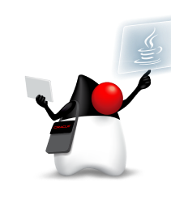Java：新生最小、完整的 VS Code 環境

| 項目 | 建議 | 原因 |
| --- | --- | --- |
| 執行環境 | 安裝課程指定的 **Oracle JDK 或 OpenJDK** | 編譯與執行 Java 的必要條件 |
| 語言支援 | **Extension Pack for Java** | 提示、除錯、測試、Maven 與專案管理 |
| 開始階段 | 先用單一 `.java` 檔練習 | 專心於輸入、輸出、條件與迴圈 |
| 專案階段 | 再使用 Maven／Gradle 專案 | 管理相依套件、測試與建置 |


<!--
講稿：
這是以 Java 起步的四技班最應先建立的環境。二技日間部以 Python 起步，二技進修部則依「程式語言」課程的實際指定環境準備。先說明 JDK 與 VS Code extension 的關係：JDK 負責把 Java 程式編譯與執行；Extension Pack for Java 則把語言提示、除錯、專案檢視等能力帶進 VS Code。兩者缺一不可。

初學時不急著介紹 Maven 或 Gradle。讓學生先完成一個單檔程式，並在終端機與 VS Code 中各執行一次，知道程式的輸出在哪裡。等學生有多個檔案、需要外部套件或測試時，再進入 Maven／Gradle，才不會把「專案設定」誤認成程式語言本身。

[Sources]
- https://www.java.com/en/
- https://www.oracle.com/java/technologies/downloads/
- https://code.visualstudio.com/docs/java/java-tutorial
- https://code.visualstudio.com/docs/java/java-project
-->

---

<!-- _class: table-medium -->

# Java JDK：選一個來源，確認課程版本

JDK 是 Java 的開發工具組；**請以課程指定的主版本為優先**，不要因為「最新」就自行換版本。

| 發行來源 | 官方入口 | 給新生的判斷方式 |
| --- | --- | --- |
| Oracle JDK | oracle.com/java/technologies/downloads | 官方 JDK；先閱讀當前版本的授權與課程版本要求 |
| Eclipse Temurin | adoptium.net/temurin/releases | 常見的 OpenJDK 發行版本，跨平台選項完整 |
| Microsoft Build of OpenJDK | learn.microsoft.com/java/openjdk | 適合在 Microsoft 開發環境中查閱安裝資訊 |
| Amazon Corretto | aws.amazon.com/corretto | Amazon 維護的 OpenJDK 發行版本 |
| Azul Zulu | azul.com/downloads | 提供多種平台與企業環境選項 |

> 課程初期，請以「全班版本一致、VS Code 找得到它」為原則。

<!--
講稿：
這一頁不要求學生比較品牌或自行選擇最高版本。老師可直接指定其中一種 JDK 與版本，讓所有學生使用相同環境。這些是常見的官方發行來源，目的是讓學生知道「Java 有多個可靠的 OpenJDK 發行版本」，而非以為只能下載單一品牌。

[Sources]
- https://www.oracle.com/java/technologies/downloads/
- https://adoptium.net/temurin/releases/
- https://learn.microsoft.com/en-us/java/openjdk/download
- https://aws.amazon.com/corretto/
- https://www.azul.com/downloads/
-->

---

# Java 安裝完成後，先在 CMD 驗證

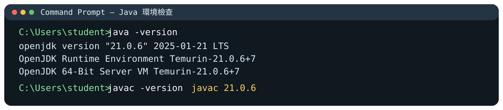

看到 `java` 與 `javac` 都能回應版本資訊，才表示「執行環境」與「編譯工具」都已準備好；若 CMD 找不到指令，再回頭確認安裝與環境設定。

---

<!-- _class: table-compact -->

# Python：選對直譯器，比多裝套件重要

| 項目 | 建議 | 初學者常見陷阱 |
| --- | --- | --- |
| 執行環境 | 從 python.org 安裝 Python，並在 VS Code 選取正確直譯器 | 裝了 Python，VS Code 卻跑到另一個版本 |
| 必裝支援 | **Python** 擴充套件 | 以為擴充套件本身就是 Python |
| 程式提示 | Pylance（隨 Python 擴充套件提供） | 忽略提示，讓小錯累積成大錯 |
| 後續工具 | Jupyter、測試、格式化工具 | 一開始全裝，卻不知道各自用途 |


<!--
講稿：
技優專班或以 Python 練習的新生，最常遇到的不是語法，而是「同一台電腦有多個 Python，VS Code 到底使用哪一個」。因此第一個教學動作要放在 Python: Select Interpreter，而不是先裝一長串套件。

Microsoft 的 Python extension 會提供執行、除錯、提示、linting 與測試等整合；Pylance 負責許多程式提示。教師可故意示範一個拼錯變數名稱的案例，讓學生看到提示並學會修改。等到要安裝資料分析或網站專案的相依套件時，再說明虛擬環境如何讓不同專案彼此隔離。

[Sources]
- https://www.python.org/community/logos/
- https://www.python.org/downloads/
- https://code.visualstudio.com/docs/languages/python
- https://code.visualstudio.com/docs/python/editing
- https://code.visualstudio.com/docs/python/environments
-->

---

# Python 安裝後：先確認版本，再執行一行程式

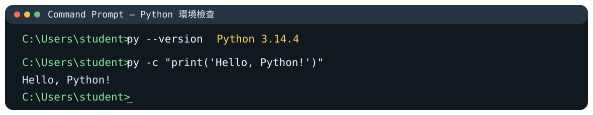

Windows 可先試 `py --version`；看到版本後，再用最小程式確認能真的執行。VS Code 選取的直譯器版本，應與你在終端機確認的環境一致。

---

<!-- _class: activity -->

# 動手檢核：我的電腦可以執行程式嗎？

依你課程使用的語言，完成其中一項即可；完成後請保留終端機畫面或文字紀錄。

| Java 路線 | Python 路線 |
| --- | --- |
| 1. 開啟 CMD／終端機<br>2. 輸入 `java -version`<br>3. 再輸入 `javac -version` | 1. 開啟 CMD／終端機<br>2. 輸入 `py --version` 或 `python --version`<br>3. 輸入一行 `print("Hello")` |

完成後自我檢查：**我看到的是版本資訊、錯誤訊息，還是完全沒有回應？** 這三種結果的下一步不同。

---

# Java／Python 實務：用 Markdown 留下操作與錯誤紀錄

| 文件 | 最常寫的內容 | VS Code 的做法 |
| --- | --- | --- |
| `README.md` | 專案目的、安裝、執行、功能與限制 | 內建預覽，邊寫邊看 |
| `notes.md` | 概念筆記、錯誤紀錄、解題步驟 | 標題、清單、程式碼區塊 |
| `CHANGELOG.md` | 每次版本做了什麼 | 和 Git commit 對照 |
| Marp 投影片 | 教學內容與講者備註 | Markdown 原始檔＋轉譯檢查 |

VS Code 原生支援 Markdown 預覽；之後可依需要加入格式化、目錄或 linting 擴充套件，**但先把內容寫清楚比先裝外掛重要。**

<!--
講稿：
程式設計不只產生程式碼，也產生能讓別人理解的文件。README 是最早該練的文件：別人拿到專案後，能否在三分鐘內知道它做什麼、怎麼跑、目前限制是什麼？這也是 GitHub 專案最基本的門面。

VS Code 對 Markdown 已有內建預覽，學生存成 .md 後就能切換編輯與預覽；本課程的 Marp 投影片也是這個工作流的延伸。等學生真的有固定需求時，再推薦 Markdown All in One、markdownlint 等擴充套件。不要讓新生一開始就把外掛數量當成能力。

[Sources]
- https://code.visualstudio.com/docs/languages/markdown
-->

---

# 第十段：DOMjudge 評量與驗證

程式能執行不代表答案一定正確；接著用測資、錯誤訊息與邊界條件，建立可驗證的解題習慣。

---

# DOMjudge：讓「正確」有可驗證的標準

DOMjudge 是用於程式競賽的自動評測系統：提交程式後，系統會編譯、執行並以測資比對輸出。

| 看到的結果 | 先問自己什麼？ |
| --- | --- |
| Accepted | 是否能解釋這段程式為何正確？ |
| Wrong Answer | 我漏了哪一種輸入或邊界情況？ |
| Runtime Error | 哪個位置可能超出範圍、空值或型別不對？ |
| Compile Error | 錯誤訊息指向哪一行、哪一個語法？ |
| Time Limit | 我的解法是否做了太多重複工作？ |

---

<!-- _class: activity -->

# 先預測，再看判定：你會測什麼？

若題目是「輸入一個分數，60 分以上顯示及格」，下列哪一筆資料**最值得特別測試**？

| A | B | C | D |
| --- | --- | --- | --- |
| `80` | `60` | `100` | `-1` |

答案不是只選一個：`60` 是**邊界**，`-1` 是**不合理輸入**；好的測試會同時看正常、邊界與例外情況。

> 在提交前先預測「哪裡可能錯」，比看到 Wrong Answer 才隨機修改更有效。

---

# 第十一段：AI 協同學習

AI 可以解釋、建議、修改甚至執行工作；因此學生要同時學會提出清楚任務、限制權限與驗證結果。

---

# AI 與 VS Code：先選工作方式，再選工具

| 你想做的事 | 合適的入口 | 上課時的原則 |
| --- | --- | --- |
| 解釋觀念、改寫筆記 | 瀏覽器中的 AI 對話 | 先自己說明，再請 AI 補強 |
| 針對目前程式碼提問 | VS Code 側欄／官方擴充套件，例如 GitHub Copilot | 只提供必要檔案與上下文 |
| 讓 AI 讀、改、測專案 | VS Code 整合終端機中的 CLI agent | 先看計畫、diff 與測試結果 |
| 長時間、多步驟任務 | 桌面／雲端 agent 介面 | 先限定資料夾與可做的動作 |

**不要同時安裝五個 AI 助手。** 先選一個聊天工具、一個程式輔助工具，練習「提出任務、檢查結果、自己驗證」。

---

<!-- _class: long-brand-title -->

# GitHub Copilot：連接 VS Code、CLI 與 GitHub

| 使用位置 | 可以協助什麼 | 新生的使用順序 |
| --- | --- | --- |
| **VS Code／IDE** | 程式碼建議、聊天、修改與 agent 工作流程 | 先練習看懂建議，只接受自己能解釋的修改 |
| **Copilot CLI** | 在終端機中規畫任務、讀寫專案與執行工具 | 會用 `git status`、`git diff` 後再嘗試 |
| **GitHub／雲端 agent** | 從 issue 或工作項目啟動任務，再審查變更與 Pull Request | 先具備分支、commit 與 Pull Request 觀念 |

> 建議起點：先在 VS Code 使用官方 Copilot 整合；能判讀差異與測試結果後，再進入 CLI 或背景代理工作。

<!--
講稿：
GitHub Copilot 不只是輸入幾個字後自動補完整行。它在 VS Code 中可以提供程式碼建議、聊天、修改與代理工作流程；Copilot CLI 則把類似能力帶進終端機，並能與 GitHub 的 issue、Pull Request 與專案脈絡連接。

對新生來說，建議先從 VS Code 開始：閱讀一小段建議、決定接受或拒絕，並親自執行確認。只有在學生已會使用 Git 查看修改、知道如何還原，且能閱讀測試結果後，才讓 CLI 或 agent 修改多個檔案。各方案、額度與功能會調整，實際安裝方式仍以官方文件為準。

[Sources]
- https://github.com/features/copilot
- https://github.com/features/copilot/ai-code-editor
- https://github.com/features/copilot/cli
- https://brand.github.com/brand-identity/copilot
- https://github.com/primer/octicons/blob/main/icons/copilot-48.svg
-->

---

# 面對 AI 工具：把它當教練，不是代寫員

可以請 AI：

- 解釋錯誤訊息與觀念，並要求它**用初學者能懂的方式**說明。
- 產生不同難度的練習題、測資與提示。
- 協助檢查命名、可讀性與遺漏的邊界情況。

仍要自己做：

- 先說出題目要解什麼、輸入與輸出是什麼。
- 親自執行、改動與驗證每一段程式。
- 清楚標示並遵守課程對 AI 使用與作業的規範。

---

# AI 的三種互動：聊天、協作、代理

| 互動方式 | AI 的角色 | 學生要保留的責任 |
| --- | --- | --- |
| 聊天（chat） | 解釋、提問、整理、產生草稿 | 判斷答案是否正確、是否適用 |
| 協作（pairing） | 依目前程式碼提供建議或修改 | 看懂每一個改動與錯誤 |
| 代理（agent） | 讀檔、規畫、改檔、執行與測試 | 設定範圍、審查計畫、diff 與結果 |

**AI 越能採取行動，人的責任就越不是減少，而是更要清楚界定任務、權限與驗證標準。**

<!--
講稿：
不要把所有 AI 工具都當成同一種聊天機器人。聊天適合用來問觀念、改寫段落或討論解法；協作模式會看著目前編輯器中的程式，提供建議；代理模式則可能讀取資料夾、修改多個檔案、執行命令甚至控制瀏覽器。

請新生把這三種互動理解成不同等級的授權。當 AI 只能回答文字時，風險多半是內容錯誤；當 AI 可以改檔或跑指令時，風險還包括刪檔、覆寫、外傳資料或在錯誤環境執行。因此工作越自動化，越要把目標、範圍、不可做的事與驗收方式說清楚。
-->

---

<!-- _class: activity -->

# 快速判斷：這件事該交給哪種 AI？

請先選擇你願意授權的最低層級，再往上加強檢查。

| 任務 | 比較適合的方式 | 你仍必須做的事 |
| --- | --- | --- |
| 解釋 `for` 迴圈 | 聊天 | 用自己的例子驗證解釋 |
| 提醒目前程式可能有錯 | 協作 | 看懂建議與實際改動 |
| 修改多個檔案並跑測試 | 代理 | 限定資料夾、先看計畫與 `git diff` |

**原則：能用較少權限完成，就不要先給更多權限。**

---

# 聊天型 AI：用來思考，不是交出答案

| 工具例子 | 適合的學習任務 | 不應直接相信的地方 |
| --- | --- | --- |
| <span class="brand-label">ChatGPT</span> | 追問概念、整理筆記、產生練習與測資 | 事實、引用、程式是否真能執行 |
| <span class="brand-label">Claude</span> | 長文件閱讀、文字整理、需求釐清 | 文件是否完整、推論是否符合情境 |
| <span class="brand-label">Gemini</span> | 文件摘要、跨媒體內容與 Google 生態任務 | 即時資料與工具可用性 |
| <span class="brand-label">Grok</span> | 對話、搜尋與觀點比較 | 網路來源品質、結論是否有證據 |

提問範例：**「不要直接給答案；先指出我程式的第一個錯誤，給一個提示，等我修改後再檢查。」**

<!--
講稿：
這一頁故意不比較誰最聰明。對新生而言，最重要的是把聊天型 AI 用成「可追問的教練」。例如讓它出一題與課堂相同難度、但資料不同的題目；請它扮演助教，只給提示不給完整答案；或請它替自己的程式設計三組邊界測資。

同時帶學生看到限制：模型可能自信地給錯資料、捏造引用，或提出看似合理但不能執行的程式。因此不能把聊天室當成答案機。學生應保留題目、自己寫的版本、執行結果與最後修正理由；這才是可評量的學習過程。

[Sources]
- https://help.openai.com/en/articles/7905742-what-does-the-official-chatgpt-ios-app-icon-look-like
- https://claude.ai/
- https://gemini.google.com/
- https://x.ai/legal/brand-guidelines
-->

---

<!-- _header: "" -->
<!-- _footer: "" -->
<!-- _paginate: false -->
<!-- _backgroundColor: "#000000" -->


<!--
[Sources]
- assets/mobile01-a7881586b43afb8dd300ad0f5f8d2da4.jpg（使用者提供）
-->

---

# Codex 與 Claude：從回答問題到操作專案

| 工具 | 主要定位 | 典型任務 |
| --- | --- | --- |
| <span class="brand-label">ChatGPT</span> | 對話、研究與內容協作 | 解釋概念、規畫作品、檢查說明文字 |
| <span class="brand-label">Codex</span> | 面向程式專案的 coding agent | 閱讀 repo、修改檔案、執行測試、檢視 diff |
| <span class="brand-label">Claude Code</span> | 終端機中的 agentic coding assistant | 搜尋專案、改程式、跑建置與測試 |
| <span class="brand-label">Claude Cowork</span> | 不需終端機的多步驟工作代理 | 處理文件、檔案、研究與可交付成果 |

> 先從「請它解釋目前專案」開始；等能判讀 Git diff 與測試結果後，再授權它修改檔案。

<!--
講稿：
先區分 ChatGPT 和 Codex：ChatGPT 很適合做對話、規畫與學習；Codex 則是針對程式專案的代理工作流，能在本機或其他支援的工作面讀取檔案、修改程式、執行命令與測試。第一堂不要讓新生直接要求「幫我做完整專題」，而是讓他們在 Git 專案中提問：「這個專案有哪些檔案？入口在哪裡？不要修改，先解釋。」

Claude 也要拆成兩個概念：Claude Code 是偏向終端機與程式工作的 agent；Claude Cowork 以不必使用終端機的多步驟工作為設計方向，適合文件、檔案與研究型工作。產品介面、方案與可用功能會調整，因此課程重點不是教學生背產品，而是辨識「目前是在聊天、在協作，還是在授權代理行動」。

[Sources]
- https://openai.com/brand/
- https://openai.com/codex/
- https://learn.chatgpt.com/docs/codex/cli
- https://claude.com/product/claude-code
- https://code.claude.com/docs/en/how-claude-code-works
- https://support.claude.com/en/articles/13345190-get-started-with-claude-cowork
-->

---

<!-- _class: long-brand-title -->

# Gemini 與 Antigravity：模型、平台與代理介面

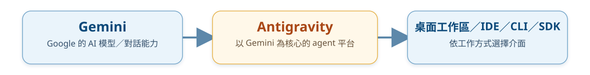

- **Antigravity IDE**：在編輯器中取得 agent、工具、MCP 與 skills 的整合。
- **Antigravity CLI**：終端機導向，適合快速迭代、SSH 與命令列工作。
- **觀念更新**：官方文件提供從 Gemini CLI 匯入設定的遷移流程；工具名稱與版本需以官方文件為準。

<!--
講稿：
學生可能把 Gemini 與 Antigravity 當成同一個產品。這裡要幫他們分層：Gemini 是 AI 模型與對話能力；Antigravity 則是把代理能力放進桌面、IDE、CLI 與 SDK 等不同介面的平台。這和「一個模型可以被不同工具使用」的概念相同。

Antigravity 的官方文件描述其 CLI 是鍵盤導向的終端介面，能處理多檔編輯、工具呼叫與對話歷史；IDE 版本則提供較完整的視覺工作區。文件也明確提到可從 Gemini CLI 進行一次性設定遷移。因此教材不將 Gemini CLI 當成固定必裝環境，而是教學生閱讀當前官方文件、確認目前版本與遷移狀態。

[Sources]
- https://gemini.google.com/
- https://antigravity.google/press?app=antigravity
- https://antigravity.google/docs/home
- https://antigravity.google/docs/cli/overview
-->

---

<!-- _class: table-compact -->

# Grok 與 OpenCode：終端機 agent 的另一種選擇

| 工具 | 目前文件呈現的工作方式 | 課程中應強調的能力 |
| --- | --- | --- |
| <span class="brand-label">Grok CLI</span> | 在目前目錄開啟互動介面；可管理模型、MCP、外掛、session 與 worktree | 看懂工作目錄、權限、session 與 Git worktree |
| <span class="brand-label">OpenCode CLI</span> | 在專案中啟動 terminal UI；可用非互動命令接到腳本或 CI | 用清楚任務描述，保存與重現工作結果 |
| 其他 agent CLI | 常有不同模型、外掛與權限設計 | 不背指令；先讀 `--help` 與官方文件 |


<!--
講稿：
這頁的目的不是推薦學生立刻安裝 Grok 或 OpenCode，而是讓他們知道：AI coding agent 已經不是單一公司的單一工具。不同產品會有自己的模型選擇、外掛、MCP、session、worktree 與權限設定；新手不可能也不需要一次學會全部。

教學時可用 Grok CLI 的 inspect、session、worktree 概念說明「工具其實會記住在哪個目錄工作、用了哪些設定」。OpenCode 的文件則呈現它可用終端介面與非互動命令搭配腳本。最重要的共同習慣是：先用 git status 看自己在哪裡；讓 agent 做一件小事；用 git diff 看它改了什麼；跑測試；確認後再 commit。

[Sources]
- https://x.ai/legal/brand-guidelines
- https://docs.x.ai/build/cli/reference
- https://opencode.ai/brand
- https://opencode.ai/v2/docs/cli
-->

---

# AI CLI 不是聊天視窗，它會在你的資料夾工作

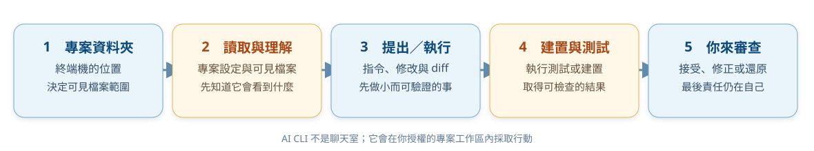

使用 CLI 前的最低準備：**一個 Git 專案、乾淨的工作區、可還原的 commit、清楚的資料夾範圍。**

<!--
講稿：
這一頁是 AI CLI 教學的安全底線。終端機 agent 通常不是只看到你貼上的幾行程式，它可能看到目前資料夾及其子檔案，還可能執行工具。因此不要在 Downloads、桌面總資料夾或含有私人資料的大資料夾裡直接啟動 agent。

示範時先建立一個小型練習專案，例如 hello-java 或 hello-python，並先做一次初始 commit。接著請 agent 只做「閱讀並解釋」；確認學生會看 git diff 後，才做一個可驗證的小修改。若結果不理想，學生知道可以還原，而不是害怕碰工具。

[Sources]
- https://learn.chatgpt.com/docs/codex/cli
- https://code.claude.com/docs/en/how-claude-code-works
- https://antigravity.google/docs/cli/overview
-->

---

<!-- _class: table-medium -->

# CLI 工作區：先會四個 Git 檢查

```bash
pwd                 # 我現在在哪個資料夾？
git status          # 哪些檔案被修改？
git diff            # 實際改了哪些內容？
git log --oneline   # 我有哪些可回頭的版本？
```

| 發現的狀況 | 先做什麼 |
| --- | --- |
| 不在專案資料夾 | `cd` 到課程指定專案，再開始 |
| 有看不懂的修改 | 先停止，讀 `git diff`，不要急著 commit |
| 還沒有版本紀錄 | 先建立小專案並做初始 commit |
| 出現帳密或個資 | 不要貼給 agent；先移出或改用測試資料 |

<!--
講稿：
這頁是所有 CLI 的共同環境，不屬於某個 AI 產品。先讓學生知道 pwd、git status、git diff、git log --oneline 四個指令的用途。只要能在授權 agent 前回答「我在哪裡、改了什麼、能不能回復」，就已經比盲目使用自動化工具安全得多。

可以安排兩人一組的口頭檢查：A 讀 git status，B 說出下一步該看什麼；再交換。此時不需要任何付費 AI 帳號，也能先建立工作流。
-->

---

# 不必同時安裝所有 CLI

| 類型 | 例子 | 教學建議 |
| --- | --- | --- |
| 程式代理 CLI | GitHub Copilot CLI、Codex、Claude Code、Antigravity CLI、Grok CLI、OpenCode | 教師示範 1 種；學生認識共同工作流 |
| 對話型 AI | ChatGPT、Claude、Gemini、Grok | 讓學生用來練習提問、比較與查證 |
| IDE／編輯器整合 | GitHub Copilot、Codex extension、Antigravity IDE extension、語言支援 extension | 依課程語言與電腦環境，選最少必要組合 |

推薦新生安裝策略：**先完成 Java 或 Python＋Git＋VS Code；AI 工具採「一個示範、一個可選」而非全員全部安裝。**

<!--
講稿：
這一頁要幫老師守住課程範圍。三天課程最怕變成帳號註冊與環境排錯大會。每種 AI CLI 的登入、方案、作業系統支援、網路權限和校方政策都可能不同；若要求全部安裝，真正的程式學習反而消失。

建議課堂採三層：所有人都完成 JDK 或 Python、Git、VS Code；教師選一個 agent 工具做 live demo；其餘工具用截圖與工作流介紹。學生若想延伸，可在課後依自己的帳號與設備選一種嘗試，並用同一個小 Git 專案比較結果。
-->

---

# 寫給 AI agent 的任務，要像交代給隊友

```text
請協助修改這個專案的成績計算程式。

目標：為 `src/score.py` 新增成績輸入範圍檢查；只有介於 0 到 100（含）之間的數值才可接受。
工作範圍：只可修改 `src/score.py`。不可新增套件、不可修改 `README`、不可刪除或改名任何檔案。
工作方式：先閱讀 `src/score.py`，說明預計修改的邏輯；接著完成最小必要修改。不要進行與此任務無關的重構。
驗收：使用提供的三組測資執行程式並顯示每組結果。完成後列出實際修改的檔案，以及每項修改的原因。
```

好的任務描述有四件事：**目標、範圍、限制、驗收方式**。

<!--
講稿：
讓學生知道，AI agent 不是讀心術。模糊地說「幫我把程式變好」通常會得到範圍不明的修改；明確地說目標、可修改範圍、不可做的事與驗收測資，才像專業團隊交付工作。

請學生先自己把這四項寫出來，再交給 AI。這同時訓練需求分析與專案溝通，也能降低 agent 動到不相關檔案的機率。
-->

---

<!-- _class: activity -->

# 改寫練習：把模糊要求變成可驗收的任務

原始說法：**「幫我把這個成績程式變好。」**

請在筆記中補上至少三項資訊：

| 目標 | 範圍與限制 | 驗收方式 |
| --- | --- | --- |
| 想改善哪一項功能？ | 只准改哪些檔案？不能做什麼？ | 要用哪些輸入確認結果？ |

完成後再問自己：**如果交給一位同學，他能知道何時算完成嗎？**

---

# AI 產生程式後：一定要走驗證迴圈

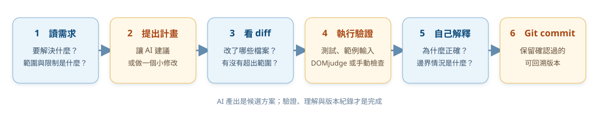

**沒有測試、沒有理解、沒有版本紀錄的 AI 產出，不是完成的作業或作品。**

<!--
講稿：
這是 AI 段落最重要的一頁。請明確告訴學生：AI 產生的文字或程式只是候選方案，不是完成品。完成的定義應由可執行、可測試、可解釋與可回溯組成。

可以用 DOMjudge 連結這個概念：就算 AI 說「程式一定正確」，只要判定是 Wrong Answer，就必須回到測資與邊界條件。再要求學生用自己的話說明程式邏輯，避免只會貼上不能解釋。
-->

---

# AI 時代更重要的三條安全界線

| 不可忽略的界線 | 新生可採取的做法 |
| --- | --- |
| 資料 | 不上傳個資、帳密、未公開資料與正式資料庫內容 |
| 權限 | 只授權課程專案；遇到刪除、外部連線、發送訊息要停下來確認 |
| 學術誠信 | 依課程規範標示 AI 協助；保留自己的思考與修改紀錄 |

當 AI 建議你跳過權限、直接執行危險命令或貼上秘密資訊時，**停下來、詢問教師、改用安全的測試環境。**

<!--
講稿：
AI agent 的風險不是遙遠的資安話題，而是學生每天會遇到的選擇：能不能把帳密貼進聊天？能不能把整個 Downloads 丟給工具？能不能讓它自動同意所有命令？這三件事都應該先回答「不行，除非你知道範圍與後果」。

以 Codex、Claude Cowork 與 Antigravity 的官方文件為例，都把權限、可存取的檔案／工具或安全設定視為重要設計。課堂可以把安全理解為專業習慣：用假資料、最小範圍、可回復版本，並在高風險動作前停下來審查。

[Sources]
- https://learn.chatgpt.com/docs/codex/cli
- https://support.claude.com/en/articles/13345190-get-started-with-claude-cowork
- https://antigravity.google/docs/cli/overview
-->

---

# 進入大學前，你已經可以先準備

1. 建立 GitHub 帳號並完成個人檔案的基本設定。
2. 安裝 VS Code、課程指定的程式語言與 Git。
3. 建一個 `programming-notes` 資料夾，開始記錄新名詞與錯誤。
4. 用一題小題目完成一次練習循環：讀題、寫程式、執行並 commit。
5. 遇到問題時，準備「題目、程式碼、錯誤、你已嘗試的方法」再提問。

---

<!-- _class: activity -->

# 離場小卡：把今天的地圖帶走

請在自己的筆記留下三句話：

1. **我想先探索的方向：**＿＿＿＿＿＿＿＿＿＿＿＿
2. **我下一個要完成的操作：**＿＿＿＿＿＿＿＿＿＿＿＿
3. **我遇到錯誤時，第一個會做的檢查：**＿＿＿＿＿＿＿＿＿＿＿＿

最後請記住：**會寫程式不是不會出錯，而是知道怎麼找到下一個線索。**

---

<!-- _class: lead -->

# 你不需要先會寫很多程式

## 你需要的是：願意拆解問題、願意練習、願意留下每一次修正的紀錄。

下一步：在三天微學分課程中，把這張地圖走成一次真實的練習循環。

---

# 第十二段：其它補充資料

工具介面會更新，但官方文件、課程公告與你自己的操作紀錄，會是最可靠的延伸學習入口。

---

# 其它補充資料：工具入口與官方文件

- 系上提供：115 學年度入學適用「四年日間部」、「四技日間部技優領航專班」、「二技日間部」與「二技進修部」資訊管理系課程科目表。
- Java（Oracle JDK 下載）：https://www.oracle.com/java/technologies/downloads/
- Java（OpenJDK 參考）：https://adoptium.net/temurin/releases/
- Python（下載與文件）：https://www.python.org/downloads/、https://docs.python.org/3/
- Visual Studio Code：https://code.visualstudio.com/
- Node.js：https://nodejs.org/
- Git：https://git-scm.com/downloads
- GitHub Docs：https://docs.github.com/en/get-started

---

# 其它補充資料：延伸技術與課程參考

- JavaScript Guide（MDN）：https://developer.mozilla.org/en-US/docs/Web/JavaScript/Guide
- Django 官方文件：https://docs.djangoproject.com/
- DOMjudge Documentation：https://www.domjudge.org/documentation
- Windows CMD 指令參考：https://learn.microsoft.com/en-us/windows-server/administration/windows-commands/
- macOS Terminal 使用手冊：https://support.apple.com/guide/terminal/welcome/mac
- Linux／Unix 常用指令參考（GNU Coreutils）：https://www.gnu.org/software/coreutils/manual/

> 課名、修課安排與工具版本可能調整，請以系上最新公告及官方文件為準。
